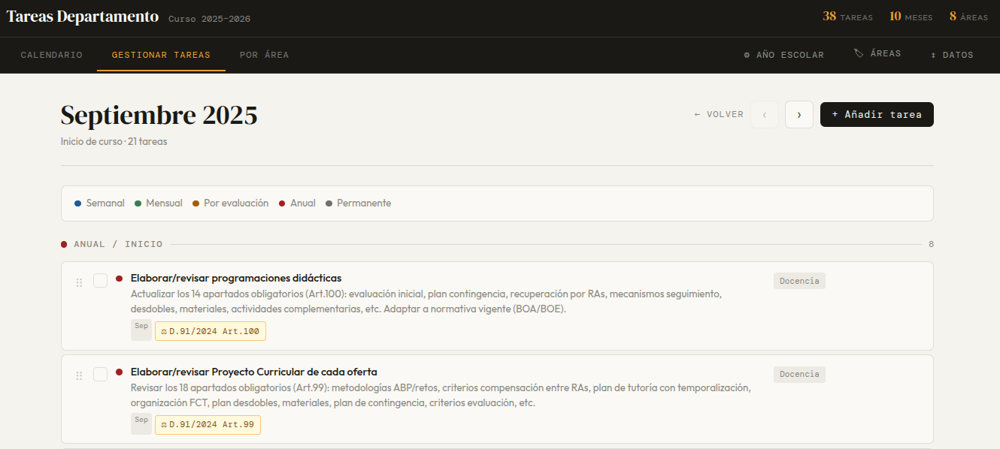

# 📋 Gestor de Tareas — Jefe de Departamento FP

Herramienta web de planificación y seguimiento de tareas para el **Jefe de Departamento de Informática** en centros de Formación Profesional de Aragón.

Desarrollada como un único archivo HTML autónomo, sin dependencias, sin servidor y sin instalación. Funciona directamente en el navegador.

---

## 🖼️ Capturas de pantalla

### Vista Anual — resumen del curso con todas las tareas por mes
<!-- Añadir captura: vista calendario modo Anual -->


### Vista Mes — gestión mensual del calendario
<!-- Añadir captura: vista calendario modo Mes -->


### Vista Semana
<!-- Añadir captura: vista calendario modo Semana -->


### Vista Día
<!-- Añadir captura: vista calendario modo Día -->


### Gestionar Tareas — catálogo global con asignación por meses
<!-- Añadir captura: pestaña Gestionar Tareas -->


### Por Área — drag & drop entre áreas de gestión
<!-- Añadir captura: pestaña Por Área -->


---

## ✨ Características

### 📅 Calendario completo
- **Vista Anual** — todas las tarjetas de mes con lista de tareas y estado de completado
- **Vista Mensual** — rejilla de días con tareas distribuidas según frecuencia
- **Vista Semanal** — 7 columnas Lun–Dom con tareas por tipo
- **Vista Diaria** — detalle del día con tareas de todo el día y por semana
- Selector de modo integrado: Anual · Mes · Semana · Día
- Navegación mes a mes, semana a semana, día a día con flechas ‹ ›

### 🗂️ Gestión de tareas global
- Las tareas son **únicas y globales** (como Google Calendar) — se crean una vez y se asignan a los meses que corresponda
- Frecuencias: Anual, Por evaluación, Mensual, Semanal, Permanente
- Selector de meses por pastillas visuales (Sep–Jun)
- Drag & drop para reordenar y mover entre grupos de frecuencia

### ⚖️ Normativa Decreto 91/2024
- Las tareas derivadas del Decreto 91/2024 (Aragón) están marcadas con el icono ⚖️ y la referencia normativa exacta
- Incluye las 8 obligaciones nuevas detectadas en el análisis: Equipo de Calidad, Proyecto Curricular (18 apartados), ABP, pruebas libres, personas expertas FP Dual, etc.

### 📝 Tareas completas
- Campo **Etiqueta** libre (referencia normativa, ubicación, etc.)
- **Estado completado** con checkbox — tareas tachadas en todas las vistas
- **Drag & drop en calendario** con selector de alcance: solo esta ocurrencia / todas las semanas de este mes / esta semana en todos los meses / todo el curso
- **Corrección por día de semana** en eventos recurrentes (mueve a "jueves" y cada mes lo pone en el jueves correcto)
- **Eventos recurrentes** con 4 opciones de edición por separado o en bloque

### 🏷️ Áreas personalizables
- 8 áreas por defecto: Docencia, Coordinación, Alumnado, Recursos, Mejora, FCT/DUAL, Calidad, Normativa
- Edición completa: nombre, icono (selector de emojis), color de fondo (paleta + selector libre)
- **Drag & drop entre áreas** en la vista Por Área

### 💾 Persistencia automática
- Guardado automático en `localStorage` del navegador — los datos sobreviven a recargas
- Punto verde 🟢 en la cabecera confirma cada guardado

### 📤 Exportar / Importar
- **JSON** — copia de seguridad completa (tareas, áreas, año escolar, estados, posiciones, overrides)
- **iCalendar (.ics)** — compatible con Google Calendar, Apple Calendar y Outlook
  - Filtro por frecuencia (Anuales, Mensuales, Semanales, Permanentes)
  - Alarma configurable (sin alarma / 1h / 1 día / 2 días antes)

### 📐 Responsive
- Adaptado a escritorio, tablet y móvil
- Modales en slide-up desde abajo en pantallas pequeñas
- Botones de acción con zona táctil amplia

---

## 🚀 Uso

1. Descarga `index.html`
2. Ábrelo en cualquier navegador moderno (Chrome, Firefox, Safari, Edge)
3. Sin instalación, sin servidor, sin conexión a internet necesaria

```
Abrir index.html en el navegador → listo
```

---

## 🗃️ Estructura del archivo

Todo el código está en un único archivo `index.html` (~2200 líneas):

```
index.html
├── CSS inline    — estilos, responsive, temas de color
├── HTML          — estructura de vistas y modales
└── JavaScript    — lógica completa (sin dependencias externas)
```

---

## 📋 Tareas incluidas por defecto

El planning incluye **39 tareas** basadas en:
- Funciones habituales del Jefe de Departamento en un IES de FP
- Obligaciones explícitas del **Decreto 91/2024** de Aragón (FP)

### Distribución por frecuencia
| Frecuencia | Nº tareas |
|---|---|
| Anual / Inicio de curso | 13 |
| Por evaluación | 7 |
| Mensual | 6 |
| Semanal | 4 |
| Permanente | 9 |

### Obligaciones del Decreto 91/2024 incluidas ⚖️
| Tarea | Artículo |
|---|---|
| Elaborar/revisar Proyecto Curricular (18 apartados) | Art. 99 |
| Programaciones didácticas (14 apartados mínimos) | Art. 100 |
| Implementar metodología ABP/Proyectos | Art. 109 |
| Reunión del Equipo de Calidad del centro | Art. 111 |
| Presidir tribunal de pruebas libres | Art. 131 |
| Participar en selección de personas expertas FP Dual | Art. 179 |
| Elaborar informe de revisión de calificaciones (1 día hábil) | Art. 39 |
| Archivar instrumentos de evaluación (3 meses) | Art. 38.3 |
| Gestión FCT vía plataforma DGA | Art. 60 |
| Seguimiento del Plan de Orientación y Acción Tutorial | Art. 95-96 |

---

## 🛠️ Tecnología

- **HTML5 / CSS3 / JavaScript ES6+** — sin frameworks, sin dependencias
- **localStorage** — persistencia local automática
- **Drag & Drop API** nativa del navegador
- **iCalendar RFC 5545** — exportación estándar para calendarios

---

## 📄 Licencia

MIT — libre para usar, modificar y distribuir.

---

## 👨‍💼 Autor

Desarrollado por **Luis J. Sol Sona**  
Profesor de Informática — IES Miguel de Molinos, Zaragoza (Aragón)  
Departamento de Informática — Ciclos SMR y FPB

---

*Generado con ayuda de Claude (Anthropic) — Junio 2026*
